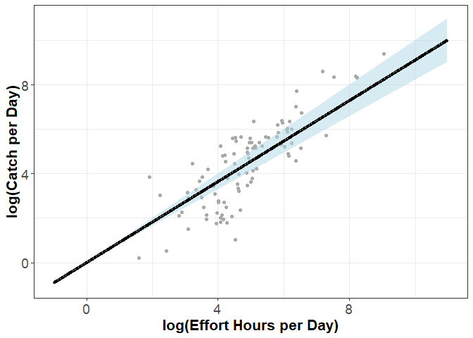
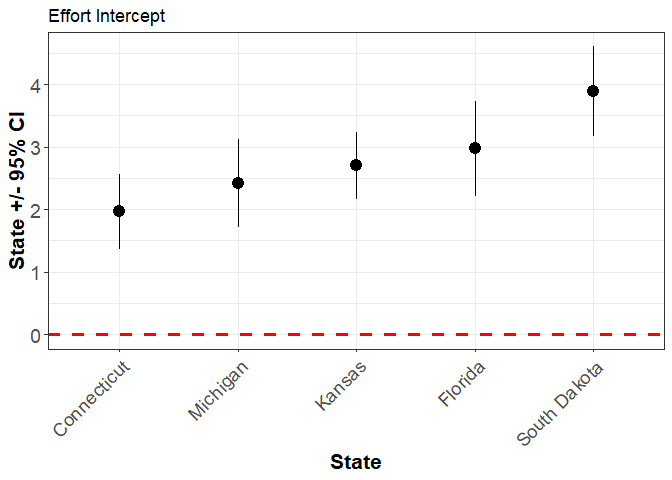
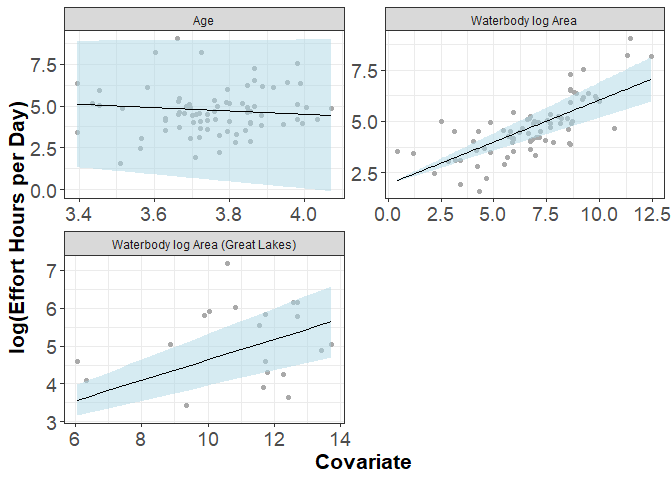

CreelCatch: a package to integrate creel surveys over space and time
================
Matthew Robertson
30/09/2022

# Overview

CreelCatch is a package designed to estimate creel surveys over space
and time by using socio-ecological covariates and sampling design random
effects to estimate fishing effort and then using that fishing effort to
estimate catch.

# Installation

Install the
[devtools](https://cran.r-project.org/web/packages/devtools/index.html)
package and run:

``` r
devtools::install_github("MatthewRobertson2452/CreelCatch")
library(CreelCatch)
```

If you are having problems with installation, you can install the
package locally as a ZIP file by clicking the Code menu and “download
ZIP” from the [github
page](https://github.com/MatthewRobertson2452/CreelCatch). You can then
extract the folder in a local directory while recording the directory
name (which I will reference as download\_dir). To install, then use

``` r
devtools::install_local(path=download_dir, dependencies=FALSE)
library(CreelCatch)
```

# Basic Example

The examples will use the provided creel survey dataset and describe
multiple model formulations that can be used to estimate catch and
effort.

To load the provided dataset,

``` r
data("example_dat")
```

This data contains the same information that is described in the paper
(Robertson et al. In prep), and information detailing what each column
contains can be examined in detail with

``` r
?example_dat
```

Creating the objects needed to run the model depends on then use of the
`model_prep` function and the description of desired model formulation
within that function. To start this example, I will show a simple model
formulation without random effects or covariates.

To run the most basic version of the model, you only need to specify the
creel estimates of catch and effort. We found the model provided the
best fit when examining both of these on then log-scale, however, this
transformation is not forced by the `model_prep` function.

``` r
output<-model_prep(catch = log(example_dat$Catch_per_day), effort = log(example_dat$Effort_per_day))
```

The `model_prep` function provides multiple outputs in a named list that
then need to be input into TMB to run the model, these include the list
of data objects (`tmb.data`), parameters (`parameters`), what parameters
should be treated as random effects (`rname`), and what parameters do
not need to be estimated (`map`).

These outputs can then be used in the following TMB functions to prepare
and run the model.

``` r
obj <- TMB::MakeADFun(data = c(model = "CreelCatch", # which model to use
                                output$tmb.data),
                       parameters = output$parameters,
                       map=output$map,random = output$rname,
                       DLL = "CreelCatch_TMBExports", silent=TRUE)

opt<-nlminb(obj$par,obj$fn,obj$gr,
            control = list(trace=10,eval.max=2000,iter.max=1000))
```

The model output data will be stored in `opt` and we can initially
determine model convergence and fit information by examining the
gradient, the negative log-likelihood and AIC and BIC,

``` r
####Largest Gradient (smaller is better)
max(obj$gr())
```

    ## [1] 0.000191929

``` r
####Negative log-likelihood
opt$objective
```

    ## [1] 372.0265

``` r
#####AIC
2*opt$objective+ 2*length(opt$par)
```

    ## [1] 752.0529

``` r
#####BIC
2*opt$objective + log(length(output$tmb.data$log_C))*length(obj$par)
```

    ## [1] 762.4736

Parameter estimates and their associated uncertainty can then be
examined using the report object (estimates), and sdreport object
(estimates and uncertainty),

``` r
rep <- obj$report()
sdrep<-TMB::sdreport(obj)
```

To manually examine parameter estimates you can index the parameter of
interest as follows (e.g. for catchability),

``` r
rep$q_dev
```

    ## [1] 0.9121706

``` r
#indexing the sdreport object for parameter estimates
val_names<-names(sdrep$value)
ind<-val_names=="q_dev"
sdrep$value[ind]
```

    ##     q_dev 
    ## 0.9121706

``` r
#indexing the sdreport object for uncertainty estimates
sdrep$sd[ind]
```

    ## [1] 0.04547975

I have also added functionality to easily plot the estimated
relationship between catch and effort by using the function `plot_cpue`

``` r
plot_cpue(rep=rep, sdrep=sdrep, tmb.data=output$tmb.data)
```

<!-- -->

# Random Effects and Covariates Example

While this basic example is useful to get a basic understanding of how
the model works, most uses of the model will seek to explore how the
model estimates can be improved by accounting for survey design
characteristics with random effects or by accounting for variability in
fishing effort with socio-ecological covariates. This example will show
how both of these can be included.

Our best model formulation came when the effort intercept varied by
region and where effort was modified by waterbody log(area). To include
these two effects, we need to slightly modify the `model_prep` function.
The function includes various “switches” that tell the model to turn on
different effects. These include `E_intercept` to treat the effort
intercept as a random effect, `C_intercept` to estimate the catch
intercept and treat it as a random effect, `catchability` to treat
catchability as a random effect, `n_covars` to tell the model how many
covariates you would like to include, and `gl_switch` to indicate
whether to differentially account for the waterbody area of Great Lakes
surveys (covered in the following example).

Turning on switches sometimes requires inputting additionally data as
well. For example, turning on a random effect requires inputting data
describing that random effect. Random effect data should be integers to
denote separate groups, where the smallest value is 0.

Here, we told the model to estimate the effort intercept as a random
effect by state and to use 1 covariate (specifically log waterbody area)
to describe effort.

``` r
output<-model_prep(catch = log(example_dat$Catch_per_day), effort = log(example_dat$Effort_per_day),
                   E_intercept = 1, random_effect = example_dat$istate, n_covars = 1, 
                   first_covar = log(example_dat$Area))
```

We can then run the model the same as before,

``` r
obj <- TMB::MakeADFun(data = c(model = "CreelCatch", # which model to use
                                output$tmb.data),
                       parameters = output$parameters,
                       map=output$map,random = output$rname,
                       DLL = "CreelCatch_TMBExports", silent=TRUE)

opt<-nlminb(obj$par,obj$fn,obj$gr,
            control = list(trace=10,eval.max=2000,iter.max=1000))

#####AIC
2*opt$objective+ 2*length(opt$par)

#####BIC
2*opt$objective + log(length(output$tmb.data$log_C))*length(obj$par)

rep <- obj$report()
sdrep<-TMB::sdreport(obj)
```

I have also included functionality to be able to easily plot estimates
of the random effects and covariates.

For the random effects, you need to input the object created from
`model_prep`, the sdrep object, and then the names associated with each
level of the random effect and the name describing what the random
effect was. The model will show the random effect point estimates and
associated 95% confidence intervals, but does not account for multiple
comparisons.

``` r
plot_re(output=output, sdrep=sdrep, names=c("Michigan","Florida","Connecticut","Kansas","South Dakota"), re_name="State")
```

<!-- -->

For covariates, you need to input model output, the object from
`model_prep`, the number of covariates that were used, and the names of
those covariates.

``` r
plot_covars(rep=rep, sdrep=sdrep, output=output, n_covar=1, covar_name=c("Waterbody Area"))
```

<!-- -->

# Accounting for the Great Lakes Example

During our model testing, we identified different relationships between
fishing effort and area for creel surveys conducted on the Great Lakes.
To account for this, our model has the capability of separately
estimating these relationships if the Great Lakes surveys are indexed.
However, including this functionality can add some complexity to model
setup, so I will provide a brief example here.

Since estimating waterbody area is itself a covariate, n\_covar must
account for this. However, because the Great Lakes waterbody area is
entered into the model as a unique variable, if additional covariates
are included they need to be input into `model_prep` as covar-1. For
example, if we wanted to examine waterbody area with separate slopes for
Great Lakes waterbodies and the effect of median county age our
`model_prep` would be,

``` r
output<-model_prep(catch = log(example_dat$Catch_per_day), effort = log(example_dat$Effort_per_day),
                   E_intercept = 1, random_effect = example_dat$istate,
                   n_covars = 2, first_covar = log(example_dat$Age),
                   gl_switch = 1, gl_area=log(example_dat$Area), iGL=example_dat$GL)
```

Where gl\_area is the input for waterbody area and iGL is the index of
whether surveys occurred on the Great Lakes or not.

Once this step is done, running the model and plotting is the same as
before but with a slight modification for plotting covariates. When
plotting covariates you only need to enter the name of covariates in
addition to waterbody area and you need to indicate that gl\_switch=1.

``` r
plot_covars(rep=rep, sdrep=sdrep, output=output, n_covar=2, covar_name=c("Age"), gl_switch=1)
```

<!-- -->
